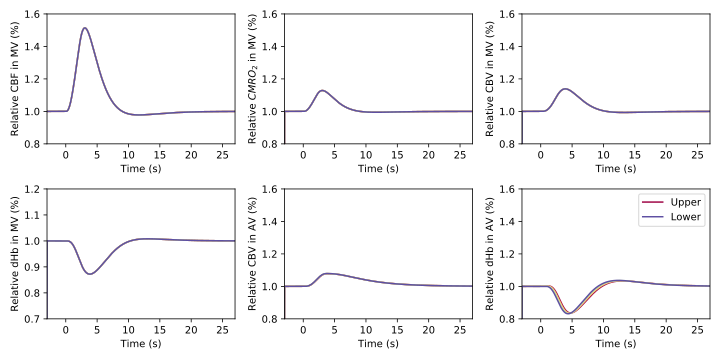
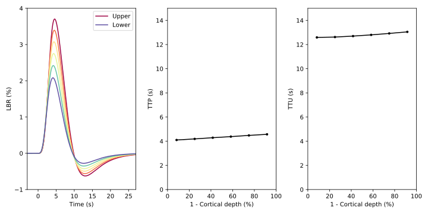

# A dynamical model of the laminar BOLD response
 Python implementation of the laminar BOLD response (LBR) moel as described in Havlicek, M. & Uludag, K (2020)
 
### Physiological Responses

 
 
### Laminar BOLD Response

